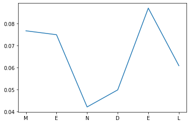
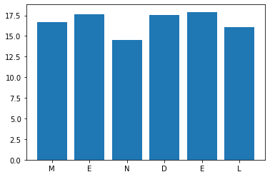
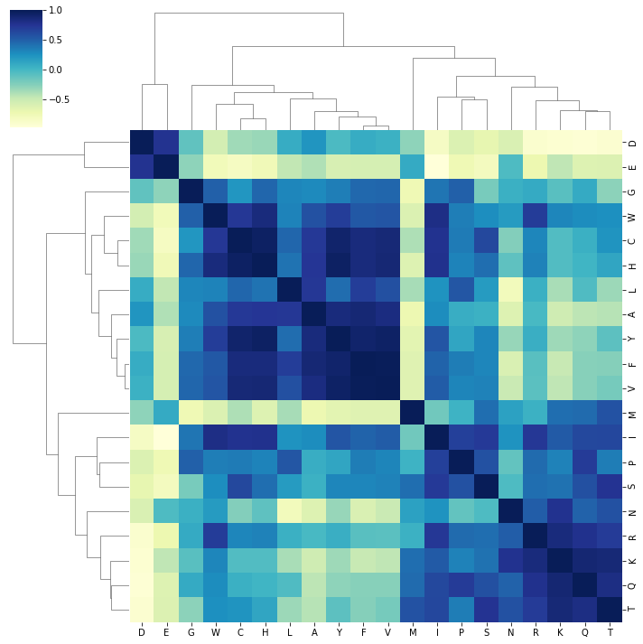
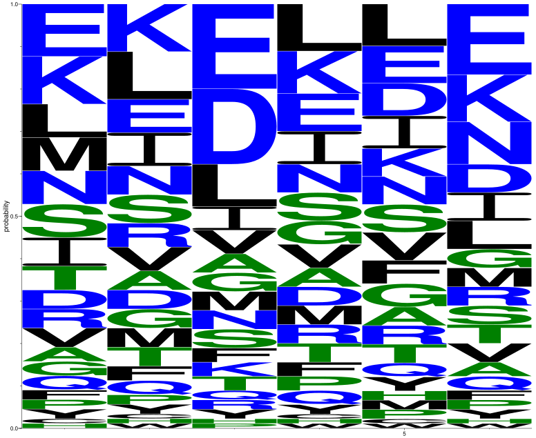

berteome
================

<!-- WARNING: THIS FILE WAS AUTOGENERATED! DO NOT EDIT! -->

## Install

`pip install berteome`

# Getting started

Berteome makes use of the masked language model of BERT to determine
predictions for all residues in a protein sequence.

The main `berteome` library can be imported as follows:

``` python
from berteome import berteome
```

The `modelLoader` class can be used to show what models are supported by
`berteome`.

``` python
berteome_models = berteome.modelLoader()
berteome_models.supported_models
```

    ['Rostlab/prot_bert',
     'facebook/esm2_t33_650M_UR50D',
     'facebook/esm1b_t33_650M_UR50S']

All of these models are distributed through huggingface, and berteome
makes great use of it’s API.

## Load model

To load prot_bert model, run the following:

``` python
bert_tokenizer, bert_model = berteome_models.load_model("Rostlab/prot_bert")
```

    Downloading:   0%|          | 0.00/81.0 [00:00<?, ?B/s]

    Downloading:   0%|          | 0.00/112 [00:00<?, ?B/s]

    Downloading:   0%|          | 0.00/86.0 [00:00<?, ?B/s]

    Downloading:   0%|          | 0.00/361 [00:00<?, ?B/s]

    Downloading:   0%|          | 0.00/1.68G [00:00<?, ?B/s]

    Some weights of the model checkpoint at Rostlab/prot_bert were not used when initializing BertForMaskedLM: ['cls.seq_relationship.weight', 'cls.seq_relationship.bias']
    - This IS expected if you are initializing BertForMaskedLM from the checkpoint of a model trained on another task or with another architecture (e.g. initializing a BertForSequenceClassification model from a BertForPreTraining model).
    - This IS NOT expected if you are initializing BertForMaskedLM from the checkpoint of a model that you expect to be exactly identical (initializing a BertForSequenceClassification model from a BertForSequenceClassification model).

The language models utilized by `berteome` were trained using a masked
token approach. In this approach, a random amino acid is masked in a
protein and the model is trained to predict what the amino acid should
be. These models do this on an incredibly large amount of protein
sequences, to the point that they begin to learn the language of protein
sequence space as we currently know it. For instance, it can start to
learn, which residues are unlikely to exist at a given point in a
protein. Using these models, you can place a mask at any given residue
in the protein, and the model will generate a probability score for all
the possible amino acids that could go there.

`berteome` allows the user to take the models and begin to really
investigate these predictions for a given protein sequence, by masking
every single residue in the protein sequence and predicting the
probabilities for all the possible amino acids. The result is a nice,
easy to work with pandas data frame. To make this dataframe for a very
simple peptide sequence (`MENDEL`), do the following:

``` python
mendel_berteome = berteome.modelPredDF("MENDEL",bert_tokenizer, bert_model)
mendel_berteome.df
```

  <div id="df-e5f727fc-7e2a-4d82-b367-c0539274e080">
    <div class="colab-df-container">
      <div>
<style scoped>
    .dataframe tbody tr th:only-of-type {
        vertical-align: middle;
    }

    .dataframe tbody tr th {
        vertical-align: top;
    }

    .dataframe thead th {
        text-align: right;
    }
</style>
<table border="1" class="dataframe">
  <thead>
    <tr style="text-align: right;">
      <th></th>
      <th>wt</th>
      <th>wtIndex</th>
      <th>wtScore</th>
      <th>n_effective</th>
      <th>topAA</th>
      <th>topAAscore</th>
      <th>A</th>
      <th>C</th>
      <th>D</th>
      <th>E</th>
      <th>...</th>
      <th>M</th>
      <th>N</th>
      <th>P</th>
      <th>Q</th>
      <th>R</th>
      <th>S</th>
      <th>T</th>
      <th>V</th>
      <th>W</th>
      <th>Y</th>
    </tr>
  </thead>
  <tbody>
    <tr>
      <th>0</th>
      <td>M</td>
      <td>1</td>
      <td>0.076602</td>
      <td>16.680519</td>
      <td>E</td>
      <td>0.118906</td>
      <td>0.036697</td>
      <td>0.011504</td>
      <td>0.048245</td>
      <td>0.118906</td>
      <td>...</td>
      <td>0.076602</td>
      <td>0.072661</td>
      <td>0.024722</td>
      <td>0.038672</td>
      <td>0.043105</td>
      <td>0.070280</td>
      <td>0.056544</td>
      <td>0.049927</td>
      <td>0.007781</td>
      <td>0.021699</td>
    </tr>
    <tr>
      <th>1</th>
      <td>E</td>
      <td>2</td>
      <td>0.074830</td>
      <td>17.599154</td>
      <td>L</td>
      <td>0.106501</td>
      <td>0.045721</td>
      <td>0.015662</td>
      <td>0.041921</td>
      <td>0.074830</td>
      <td>...</td>
      <td>0.043581</td>
      <td>0.062667</td>
      <td>0.025277</td>
      <td>0.036911</td>
      <td>0.055543</td>
      <td>0.064425</td>
      <td>0.049955</td>
      <td>0.056789</td>
      <td>0.012691</td>
      <td>0.029893</td>
    </tr>
    <tr>
      <th>2</th>
      <td>N</td>
      <td>3</td>
      <td>0.041990</td>
      <td>14.518531</td>
      <td>E</td>
      <td>0.184364</td>
      <td>0.043564</td>
      <td>0.009685</td>
      <td>0.162590</td>
      <td>0.184364</td>
      <td>...</td>
      <td>0.041484</td>
      <td>0.041990</td>
      <td>0.019992</td>
      <td>0.025515</td>
      <td>0.029433</td>
      <td>0.048106</td>
      <td>0.030303</td>
      <td>0.054742</td>
      <td>0.007430</td>
      <td>0.024924</td>
    </tr>
    <tr>
      <th>3</th>
      <td>D</td>
      <td>4</td>
      <td>0.049748</td>
      <td>17.561047</td>
      <td>L</td>
      <td>0.109088</td>
      <td>0.042083</td>
      <td>0.013244</td>
      <td>0.049748</td>
      <td>0.086194</td>
      <td>...</td>
      <td>0.040080</td>
      <td>0.060822</td>
      <td>0.032024</td>
      <td>0.039689</td>
      <td>0.046228</td>
      <td>0.062323</td>
      <td>0.044901</td>
      <td>0.058937</td>
      <td>0.010875</td>
      <td>0.026596</td>
    </tr>
    <tr>
      <th>4</th>
      <td>E</td>
      <td>5</td>
      <td>0.086915</td>
      <td>17.921406</td>
      <td>L</td>
      <td>0.090807</td>
      <td>0.046641</td>
      <td>0.018770</td>
      <td>0.079822</td>
      <td>0.086915</td>
      <td>...</td>
      <td>0.028962</td>
      <td>0.062234</td>
      <td>0.023879</td>
      <td>0.030534</td>
      <td>0.040489</td>
      <td>0.065195</td>
      <td>0.044938</td>
      <td>0.068038</td>
      <td>0.012156</td>
      <td>0.038034</td>
    </tr>
    <tr>
      <th>5</th>
      <td>L</td>
      <td>6</td>
      <td>0.060736</td>
      <td>16.068075</td>
      <td>E</td>
      <td>0.152547</td>
      <td>0.038191</td>
      <td>0.009217</td>
      <td>0.065189</td>
      <td>0.152547</td>
      <td>...</td>
      <td>0.040042</td>
      <td>0.096484</td>
      <td>0.020712</td>
      <td>0.035022</td>
      <td>0.046888</td>
      <td>0.049071</td>
      <td>0.046247</td>
      <td>0.048276</td>
      <td>0.010486</td>
      <td>0.022727</td>
    </tr>
  </tbody>
</table>
<p>6 rows × 26 columns</p>
</div>
      <button class="colab-df-convert" onclick="convertToInteractive('df-e5f727fc-7e2a-4d82-b367-c0539274e080')"
              title="Convert this dataframe to an interactive table."
              style="display:none;">
        
  <svg xmlns="http://www.w3.org/2000/svg" height="24px"viewBox="0 0 24 24"
       width="24px">
    <path d="M0 0h24v24H0V0z" fill="none"/>
    <path d="M18.56 5.44l.94 2.06.94-2.06 2.06-.94-2.06-.94-.94-2.06-.94 2.06-2.06.94zm-11 1L8.5 8.5l.94-2.06 2.06-.94-2.06-.94L8.5 2.5l-.94 2.06-2.06.94zm10 10l.94 2.06.94-2.06 2.06-.94-2.06-.94-.94-2.06-.94 2.06-2.06.94z"/><path d="M17.41 7.96l-1.37-1.37c-.4-.4-.92-.59-1.43-.59-.52 0-1.04.2-1.43.59L10.3 9.45l-7.72 7.72c-.78.78-.78 2.05 0 2.83L4 21.41c.39.39.9.59 1.41.59.51 0 1.02-.2 1.41-.59l7.78-7.78 2.81-2.81c.8-.78.8-2.07 0-2.86zM5.41 20L4 18.59l7.72-7.72 1.47 1.35L5.41 20z"/>
  </svg>
      </button>
      
  <style>
    .colab-df-container {
      display:flex;
      flex-wrap:wrap;
      gap: 12px;
    }

    .colab-df-convert {
      background-color: #E8F0FE;
      border: none;
      border-radius: 50%;
      cursor: pointer;
      display: none;
      fill: #1967D2;
      height: 32px;
      padding: 0 0 0 0;
      width: 32px;
    }

    .colab-df-convert:hover {
      background-color: #E2EBFA;
      box-shadow: 0px 1px 2px rgba(60, 64, 67, 0.3), 0px 1px 3px 1px rgba(60, 64, 67, 0.15);
      fill: #174EA6;
    }

    [theme=dark] .colab-df-convert {
      background-color: #3B4455;
      fill: #D2E3FC;
    }

    [theme=dark] .colab-df-convert:hover {
      background-color: #434B5C;
      box-shadow: 0px 1px 3px 1px rgba(0, 0, 0, 0.15);
      filter: drop-shadow(0px 1px 2px rgba(0, 0, 0, 0.3));
      fill: #FFFFFF;
    }
  </style>

      <script>
        const buttonEl =
          document.querySelector('#df-e5f727fc-7e2a-4d82-b367-c0539274e080 button.colab-df-convert');
        buttonEl.style.display =
          google.colab.kernel.accessAllowed ? 'block' : 'none';

        async function convertToInteractive(key) {
          const element = document.querySelector('#df-e5f727fc-7e2a-4d82-b367-c0539274e080');
          const dataTable =
            await google.colab.kernel.invokeFunction('convertToInteractive',
                                                     [key], {});
          if (!dataTable) return;

          const docLinkHtml = 'Like what you see? Visit the ' +
            '<a target="_blank" href=https://colab.research.google.com/notebooks/data_table.ipynb>data table notebook</a>'
            + ' to learn more about interactive tables.';
          element.innerHTML = '';
          dataTable['output_type'] = 'display_data';
          await google.colab.output.renderOutput(dataTable, element);
          const docLink = document.createElement('div');
          docLink.innerHTML = docLinkHtml;
          element.appendChild(docLink);
        }
      </script>
    </div>
  </div>
  

This dataframe is where the true berteomic magic begins. Each row
corresponds to each residue in the input protein sequence.

Here is a breakdown of some the columns in the dataframe.

- `wt` represents the actual amino acid at the given position \`
- `wtIndex` is just a one-based index of the residue which makes
  plotting easier, may not stick around forever though..-
- `wtScore` is a very interesting and important value. For a given
  protein, one would hope that the model would predict that the masked
  residue would be the same as the wild-type in the sequence. This
  column gives us the actual probability that the model provided for the
  wild type residue at that position.
- `n_effective` is a measure of site-specific variability which gives a
  proxy of how many amino acids could occupy that site and is defined as
  $N_{eff}(i) = exp(-\sum p_{ji} \ln p_{ji})$
- `topAA` is the top scoring amino acid at a given position in the
  protein
- `topAAscore` is the score of the top scoring amino acid at a given
  position in the protein

The remaining columns are simply the probabilities of each possible
amino acid generated by the model when placing a mask at every residue
in the input protein.

# Score sequence

The average score for the wild type sequence and the top sequence are
recorded as following using the `scoreSeq()` function

``` python
print(mendel_berteome.wtSeq, mendel_berteome.wtSeqScore)
```

    MENDEL 0.06513695385878104

``` python
print(mendel_berteome.topAASeq, mendel_berteome.topAASeqScore)
```

    ELELLE 0.127035315825644

To test the score of another given protein of the same length as the
input provide it to `scoreSeq()`

``` python
mendel_berteome.scoreSeq("LEDNEM")
```

    0.08294879426692443

## Amino acid correlation

For a given berteome dataframe, to investigate how correlated the
predictions of the different amino acids are to each other, the
`aa_correlation()` can be used to generate a correlation dataframe

``` python
mendel_berteome.aa_correlation()
```

  <div id="df-b5a45e62-8d46-44b2-8dd4-42bd09618271">
    <div class="colab-df-container">
      <div>
<style scoped>
    .dataframe tbody tr th:only-of-type {
        vertical-align: middle;
    }

    .dataframe tbody tr th {
        vertical-align: top;
    }

    .dataframe thead th {
        text-align: right;
    }
</style>
<table border="1" class="dataframe">
  <thead>
    <tr style="text-align: right;">
      <th></th>
      <th>A</th>
      <th>C</th>
      <th>D</th>
      <th>E</th>
      <th>F</th>
      <th>G</th>
      <th>H</th>
      <th>I</th>
      <th>K</th>
      <th>L</th>
      <th>M</th>
      <th>N</th>
      <th>P</th>
      <th>Q</th>
      <th>R</th>
      <th>S</th>
      <th>T</th>
      <th>V</th>
      <th>W</th>
      <th>Y</th>
    </tr>
  </thead>
  <tbody>
    <tr>
      <th>A</th>
      <td>1.000000</td>
      <td>0.728715</td>
      <td>0.235810</td>
      <td>-0.389880</td>
      <td>0.879478</td>
      <td>0.295939</td>
      <td>0.745629</td>
      <td>0.281994</td>
      <td>-0.521591</td>
      <td>0.733512</td>
      <td>-0.720194</td>
      <td>-0.611639</td>
      <td>0.079973</td>
      <td>-0.433475</td>
      <td>-0.010752</td>
      <td>0.051076</td>
      <td>-0.411044</td>
      <td>0.833235</td>
      <td>0.585926</td>
      <td>0.854028</td>
    </tr>
    <tr>
      <th>C</th>
      <td>0.728715</td>
      <td>1.000000</td>
      <td>-0.335086</td>
      <td>-0.816555</td>
      <td>0.854112</td>
      <td>0.231240</td>
      <td>0.948531</td>
      <td>0.774243</td>
      <td>-0.042334</td>
      <td>0.466360</td>
      <td>-0.382031</td>
      <td>-0.235096</td>
      <td>0.369489</td>
      <td>0.063834</td>
      <td>0.313217</td>
      <td>0.638680</td>
      <td>0.247711</td>
      <td>0.876376</td>
      <td>0.736407</td>
      <td>0.923179</td>
    </tr>
    <tr>
      <th>D</th>
      <td>0.235810</td>
      <td>-0.335086</td>
      <td>1.000000</td>
      <td>0.765980</td>
      <td>0.084237</td>
      <td>-0.105943</td>
      <td>-0.311785</td>
      <td>-0.822663</td>
      <td>-0.909457</td>
      <td>0.087421</td>
      <td>-0.275042</td>
      <td>-0.581996</td>
      <td>-0.599214</td>
      <td>-0.924922</td>
      <td>-0.890910</td>
      <td>-0.671449</td>
      <td>-0.903984</td>
      <td>0.053589</td>
      <td>-0.545103</td>
      <td>-0.021774</td>
    </tr>
    <tr>
      <th>E</th>
      <td>-0.389880</td>
      <td>-0.816555</td>
      <td>0.765980</td>
      <td>1.000000</td>
      <td>-0.555584</td>
      <td>-0.275365</td>
      <td>-0.756599</td>
      <td>-0.960437</td>
      <td>-0.445062</td>
      <td>-0.449607</td>
      <td>0.096590</td>
      <td>-0.027763</td>
      <td>-0.732526</td>
      <td>-0.612387</td>
      <td>-0.710517</td>
      <td>-0.797275</td>
      <td>-0.600745</td>
      <td>-0.555534</td>
      <td>-0.767346</td>
      <td>-0.570185</td>
    </tr>
    <tr>
      <th>F</th>
      <td>0.879478</td>
      <td>0.854112</td>
      <td>0.084237</td>
      <td>-0.555584</td>
      <td>1.000000</td>
      <td>0.456554</td>
      <td>0.850721</td>
      <td>0.485917</td>
      <td>-0.477467</td>
      <td>0.699526</td>
      <td>-0.622552</td>
      <td>-0.579098</td>
      <td>0.359107</td>
      <td>-0.254099</td>
      <td>-0.072739</td>
      <td>0.316781</td>
      <td>-0.244826</td>
      <td>0.988906</td>
      <td>0.546931</td>
      <td>0.916871</td>
    </tr>
    <tr>
      <th>G</th>
      <td>0.295939</td>
      <td>0.231240</td>
      <td>-0.105943</td>
      <td>-0.275365</td>
      <td>0.456554</td>
      <td>1.000000</td>
      <td>0.469717</td>
      <td>0.397913</td>
      <td>-0.077729</td>
      <td>0.311335</td>
      <td>-0.730916</td>
      <td>0.058536</td>
      <td>0.495873</td>
      <td>0.101611</td>
      <td>0.103227</td>
      <td>-0.197846</td>
      <td>-0.268709</td>
      <td>0.464575</td>
      <td>0.501189</td>
      <td>0.351613</td>
    </tr>
    <tr>
      <th>H</th>
      <td>0.745629</td>
      <td>0.948531</td>
      <td>-0.311785</td>
      <td>-0.756599</td>
      <td>0.850721</td>
      <td>0.469717</td>
      <td>1.000000</td>
      <td>0.780563</td>
      <td>-0.042422</td>
      <td>0.403466</td>
      <td>-0.613977</td>
      <td>-0.096189</td>
      <td>0.331730</td>
      <td>0.020781</td>
      <td>0.334186</td>
      <td>0.428619</td>
      <td>0.133945</td>
      <td>0.884543</td>
      <td>0.852824</td>
      <td>0.949147</td>
    </tr>
    <tr>
      <th>I</th>
      <td>0.281994</td>
      <td>0.774243</td>
      <td>-0.822663</td>
      <td>-0.960437</td>
      <td>0.485917</td>
      <td>0.397913</td>
      <td>0.780563</td>
      <td>1.000000</td>
      <td>0.529266</td>
      <td>0.250584</td>
      <td>-0.168636</td>
      <td>0.251695</td>
      <td>0.680964</td>
      <td>0.638904</td>
      <td>0.732240</td>
      <td>0.718683</td>
      <td>0.641502</td>
      <td>0.519188</td>
      <td>0.816000</td>
      <td>0.560873</td>
    </tr>
    <tr>
      <th>K</th>
      <td>-0.521591</td>
      <td>-0.042334</td>
      <td>-0.909457</td>
      <td>-0.445062</td>
      <td>-0.477467</td>
      <td>-0.077729</td>
      <td>-0.042422</td>
      <td>0.529266</td>
      <td>1.000000</td>
      <td>-0.363205</td>
      <td>0.430718</td>
      <td>0.773594</td>
      <td>0.335643</td>
      <td>0.889435</td>
      <td>0.850884</td>
      <td>0.411444</td>
      <td>0.872260</td>
      <td>-0.447166</td>
      <td>0.317516</td>
      <td>-0.325412</td>
    </tr>
    <tr>
      <th>L</th>
      <td>0.733512</td>
      <td>0.466360</td>
      <td>0.087421</td>
      <td>-0.449607</td>
      <td>0.699526</td>
      <td>0.311335</td>
      <td>0.403466</td>
      <td>0.250584</td>
      <td>-0.363205</td>
      <td>1.000000</td>
      <td>-0.360750</td>
      <td>-0.779562</td>
      <td>0.554163</td>
      <td>-0.037801</td>
      <td>0.062683</td>
      <td>0.196178</td>
      <td>-0.320043</td>
      <td>0.588138</td>
      <td>0.326964</td>
      <td>0.436263</td>
    </tr>
    <tr>
      <th>M</th>
      <td>-0.720194</td>
      <td>-0.382031</td>
      <td>-0.275042</td>
      <td>0.096590</td>
      <td>-0.622552</td>
      <td>-0.730916</td>
      <td>-0.613977</td>
      <td>-0.168636</td>
      <td>0.430718</td>
      <td>-0.360750</td>
      <td>1.000000</td>
      <td>0.161152</td>
      <td>0.038821</td>
      <td>0.444465</td>
      <td>0.054119</td>
      <td>0.430616</td>
      <td>0.575785</td>
      <td>-0.620563</td>
      <td>-0.596729</td>
      <td>-0.652699</td>
    </tr>
    <tr>
      <th>N</th>
      <td>-0.611639</td>
      <td>-0.235096</td>
      <td>-0.581996</td>
      <td>-0.027763</td>
      <td>-0.579098</td>
      <td>0.058536</td>
      <td>-0.096189</td>
      <td>0.251695</td>
      <td>0.773594</td>
      <td>-0.779562</td>
      <td>0.161152</td>
      <td>1.000000</td>
      <td>-0.116807</td>
      <td>0.493941</td>
      <td>0.512855</td>
      <td>-0.030990</td>
      <td>0.583399</td>
      <td>-0.486083</td>
      <td>0.203204</td>
      <td>-0.307123</td>
    </tr>
    <tr>
      <th>P</th>
      <td>0.079973</td>
      <td>0.369489</td>
      <td>-0.599214</td>
      <td>-0.732526</td>
      <td>0.359107</td>
      <td>0.495873</td>
      <td>0.331730</td>
      <td>0.680964</td>
      <td>0.335643</td>
      <td>0.554163</td>
      <td>0.038821</td>
      <td>-0.116807</td>
      <td>1.000000</td>
      <td>0.711244</td>
      <td>0.444691</td>
      <td>0.584905</td>
      <td>0.362911</td>
      <td>0.320277</td>
      <td>0.353894</td>
      <td>0.130555</td>
    </tr>
    <tr>
      <th>Q</th>
      <td>-0.433475</td>
      <td>0.063834</td>
      <td>-0.924922</td>
      <td>-0.612387</td>
      <td>-0.254099</td>
      <td>0.101611</td>
      <td>0.020781</td>
      <td>0.638904</td>
      <td>0.889435</td>
      <td>-0.037801</td>
      <td>0.444465</td>
      <td>0.493941</td>
      <td>0.711244</td>
      <td>1.000000</td>
      <td>0.778685</td>
      <td>0.589468</td>
      <td>0.823070</td>
      <td>-0.252472</td>
      <td>0.281362</td>
      <td>-0.272660</td>
    </tr>
    <tr>
      <th>R</th>
      <td>-0.010752</td>
      <td>0.313217</td>
      <td>-0.890910</td>
      <td>-0.710517</td>
      <td>-0.072739</td>
      <td>0.103227</td>
      <td>0.334186</td>
      <td>0.732240</td>
      <td>0.850884</td>
      <td>0.062683</td>
      <td>0.054119</td>
      <td>0.512855</td>
      <td>0.444691</td>
      <td>0.778685</td>
      <td>1.000000</td>
      <td>0.432145</td>
      <td>0.713224</td>
      <td>-0.081317</td>
      <td>0.706977</td>
      <td>0.066199</td>
    </tr>
    <tr>
      <th>S</th>
      <td>0.051076</td>
      <td>0.638680</td>
      <td>-0.671449</td>
      <td>-0.797275</td>
      <td>0.316781</td>
      <td>-0.197846</td>
      <td>0.428619</td>
      <td>0.718683</td>
      <td>0.411444</td>
      <td>0.196178</td>
      <td>0.430616</td>
      <td>-0.030990</td>
      <td>0.584905</td>
      <td>0.589468</td>
      <td>0.432145</td>
      <td>1.000000</td>
      <td>0.762126</td>
      <td>0.338214</td>
      <td>0.276284</td>
      <td>0.313994</td>
    </tr>
    <tr>
      <th>T</th>
      <td>-0.411044</td>
      <td>0.247711</td>
      <td>-0.903984</td>
      <td>-0.600745</td>
      <td>-0.244826</td>
      <td>-0.268709</td>
      <td>0.133945</td>
      <td>0.641502</td>
      <td>0.872260</td>
      <td>-0.320043</td>
      <td>0.575785</td>
      <td>0.583399</td>
      <td>0.362911</td>
      <td>0.823070</td>
      <td>0.713224</td>
      <td>0.762126</td>
      <td>1.000000</td>
      <td>-0.191172</td>
      <td>0.265531</td>
      <td>-0.089424</td>
    </tr>
    <tr>
      <th>V</th>
      <td>0.833235</td>
      <td>0.876376</td>
      <td>0.053589</td>
      <td>-0.555534</td>
      <td>0.988906</td>
      <td>0.464575</td>
      <td>0.884543</td>
      <td>0.519188</td>
      <td>-0.447166</td>
      <td>0.588138</td>
      <td>-0.620563</td>
      <td>-0.486083</td>
      <td>0.320277</td>
      <td>-0.252472</td>
      <td>-0.081317</td>
      <td>0.338214</td>
      <td>-0.191172</td>
      <td>1.000000</td>
      <td>0.557270</td>
      <td>0.944823</td>
    </tr>
    <tr>
      <th>W</th>
      <td>0.585926</td>
      <td>0.736407</td>
      <td>-0.545103</td>
      <td>-0.767346</td>
      <td>0.546931</td>
      <td>0.501189</td>
      <td>0.852824</td>
      <td>0.816000</td>
      <td>0.317516</td>
      <td>0.326964</td>
      <td>-0.596729</td>
      <td>0.203204</td>
      <td>0.353894</td>
      <td>0.281362</td>
      <td>0.706977</td>
      <td>0.276284</td>
      <td>0.265531</td>
      <td>0.557270</td>
      <td>1.000000</td>
      <td>0.694812</td>
    </tr>
    <tr>
      <th>Y</th>
      <td>0.854028</td>
      <td>0.923179</td>
      <td>-0.021774</td>
      <td>-0.570185</td>
      <td>0.916871</td>
      <td>0.351613</td>
      <td>0.949147</td>
      <td>0.560873</td>
      <td>-0.325412</td>
      <td>0.436263</td>
      <td>-0.652699</td>
      <td>-0.307123</td>
      <td>0.130555</td>
      <td>-0.272660</td>
      <td>0.066199</td>
      <td>0.313994</td>
      <td>-0.089424</td>
      <td>0.944823</td>
      <td>0.694812</td>
      <td>1.000000</td>
    </tr>
  </tbody>
</table>
</div>
      <button class="colab-df-convert" onclick="convertToInteractive('df-b5a45e62-8d46-44b2-8dd4-42bd09618271')"
              title="Convert this dataframe to an interactive table."
              style="display:none;">
        
  <svg xmlns="http://www.w3.org/2000/svg" height="24px"viewBox="0 0 24 24"
       width="24px">
    <path d="M0 0h24v24H0V0z" fill="none"/>
    <path d="M18.56 5.44l.94 2.06.94-2.06 2.06-.94-2.06-.94-.94-2.06-.94 2.06-2.06.94zm-11 1L8.5 8.5l.94-2.06 2.06-.94-2.06-.94L8.5 2.5l-.94 2.06-2.06.94zm10 10l.94 2.06.94-2.06 2.06-.94-2.06-.94-.94-2.06-.94 2.06-2.06.94z"/><path d="M17.41 7.96l-1.37-1.37c-.4-.4-.92-.59-1.43-.59-.52 0-1.04.2-1.43.59L10.3 9.45l-7.72 7.72c-.78.78-.78 2.05 0 2.83L4 21.41c.39.39.9.59 1.41.59.51 0 1.02-.2 1.41-.59l7.78-7.78 2.81-2.81c.8-.78.8-2.07 0-2.86zM5.41 20L4 18.59l7.72-7.72 1.47 1.35L5.41 20z"/>
  </svg>
      </button>
      
  <style>
    .colab-df-container {
      display:flex;
      flex-wrap:wrap;
      gap: 12px;
    }

    .colab-df-convert {
      background-color: #E8F0FE;
      border: none;
      border-radius: 50%;
      cursor: pointer;
      display: none;
      fill: #1967D2;
      height: 32px;
      padding: 0 0 0 0;
      width: 32px;
    }

    .colab-df-convert:hover {
      background-color: #E2EBFA;
      box-shadow: 0px 1px 2px rgba(60, 64, 67, 0.3), 0px 1px 3px 1px rgba(60, 64, 67, 0.15);
      fill: #174EA6;
    }

    [theme=dark] .colab-df-convert {
      background-color: #3B4455;
      fill: #D2E3FC;
    }

    [theme=dark] .colab-df-convert:hover {
      background-color: #434B5C;
      box-shadow: 0px 1px 3px 1px rgba(0, 0, 0, 0.15);
      filter: drop-shadow(0px 1px 2px rgba(0, 0, 0, 0.3));
      fill: #FFFFFF;
    }
  </style>

      <script>
        const buttonEl =
          document.querySelector('#df-b5a45e62-8d46-44b2-8dd4-42bd09618271 button.colab-df-convert');
        buttonEl.style.display =
          google.colab.kernel.accessAllowed ? 'block' : 'none';

        async function convertToInteractive(key) {
          const element = document.querySelector('#df-b5a45e62-8d46-44b2-8dd4-42bd09618271');
          const dataTable =
            await google.colab.kernel.invokeFunction('convertToInteractive',
                                                     [key], {});
          if (!dataTable) return;

          const docLinkHtml = 'Like what you see? Visit the ' +
            '<a target="_blank" href=https://colab.research.google.com/notebooks/data_table.ipynb>data table notebook</a>'
            + ' to learn more about interactive tables.';
          element.innerHTML = '';
          dataTable['output_type'] = 'display_data';
          await google.colab.output.renderOutput(dataTable, element);
          const docLink = document.createElement('div');
          docLink.innerHTML = docLinkHtml;
          element.appendChild(docLink);
        }
      </script>
    </div>
  </div>
  

## Most probable variants

`berteome` can also be used to generate single residue substitution
variants for the top k amino acids for a given residue in a protein. To
generate the top 3 mutational variants for `MENDEL` the `generate`
submodule can be loaded and used as follows:

``` python
from berteome import generate
```

``` python
generate.top_k_variants(mendel_berteome, 3)
```

  <div id="df-2a466348-412a-470f-9ddd-c41f12392126">
    <div class="colab-df-container">
      <div>
<style scoped>
    .dataframe tbody tr th:only-of-type {
        vertical-align: middle;
    }

    .dataframe tbody tr th {
        vertical-align: top;
    }

    .dataframe thead th {
        text-align: right;
    }
</style>
<table border="1" class="dataframe">
  <thead>
    <tr style="text-align: right;">
      <th></th>
      <th>sub</th>
      <th>seq</th>
    </tr>
  </thead>
  <tbody>
    <tr>
      <th>0</th>
      <td>0subE</td>
      <td>EENDEL</td>
    </tr>
    <tr>
      <th>1</th>
      <td>0subK</td>
      <td>KENDEL</td>
    </tr>
    <tr>
      <th>2</th>
      <td>0subN</td>
      <td>NENDEL</td>
    </tr>
    <tr>
      <th>3</th>
      <td>1subL</td>
      <td>MLNDEL</td>
    </tr>
    <tr>
      <th>4</th>
      <td>1subK</td>
      <td>MKNDEL</td>
    </tr>
    <tr>
      <th>5</th>
      <td>1subI</td>
      <td>MINDEL</td>
    </tr>
    <tr>
      <th>6</th>
      <td>2subE</td>
      <td>MEEDEL</td>
    </tr>
    <tr>
      <th>7</th>
      <td>2subD</td>
      <td>MEDDEL</td>
    </tr>
    <tr>
      <th>8</th>
      <td>2subL</td>
      <td>MELDEL</td>
    </tr>
    <tr>
      <th>9</th>
      <td>3subL</td>
      <td>MENLEL</td>
    </tr>
    <tr>
      <th>10</th>
      <td>3subK</td>
      <td>MENKEL</td>
    </tr>
    <tr>
      <th>11</th>
      <td>3subE</td>
      <td>MENEEL</td>
    </tr>
    <tr>
      <th>12</th>
      <td>4subL</td>
      <td>MENDLL</td>
    </tr>
    <tr>
      <th>13</th>
      <td>4subD</td>
      <td>MENDDL</td>
    </tr>
    <tr>
      <th>14</th>
      <td>4subI</td>
      <td>MENDIL</td>
    </tr>
    <tr>
      <th>15</th>
      <td>5subE</td>
      <td>MENDEE</td>
    </tr>
    <tr>
      <th>16</th>
      <td>5subK</td>
      <td>MENDEK</td>
    </tr>
    <tr>
      <th>17</th>
      <td>5subN</td>
      <td>MENDEN</td>
    </tr>
  </tbody>
</table>
</div>
      <button class="colab-df-convert" onclick="convertToInteractive('df-2a466348-412a-470f-9ddd-c41f12392126')"
              title="Convert this dataframe to an interactive table."
              style="display:none;">
        
  <svg xmlns="http://www.w3.org/2000/svg" height="24px"viewBox="0 0 24 24"
       width="24px">
    <path d="M0 0h24v24H0V0z" fill="none"/>
    <path d="M18.56 5.44l.94 2.06.94-2.06 2.06-.94-2.06-.94-.94-2.06-.94 2.06-2.06.94zm-11 1L8.5 8.5l.94-2.06 2.06-.94-2.06-.94L8.5 2.5l-.94 2.06-2.06.94zm10 10l.94 2.06.94-2.06 2.06-.94-2.06-.94-.94-2.06-.94 2.06-2.06.94z"/><path d="M17.41 7.96l-1.37-1.37c-.4-.4-.92-.59-1.43-.59-.52 0-1.04.2-1.43.59L10.3 9.45l-7.72 7.72c-.78.78-.78 2.05 0 2.83L4 21.41c.39.39.9.59 1.41.59.51 0 1.02-.2 1.41-.59l7.78-7.78 2.81-2.81c.8-.78.8-2.07 0-2.86zM5.41 20L4 18.59l7.72-7.72 1.47 1.35L5.41 20z"/>
  </svg>
      </button>
      
  <style>
    .colab-df-container {
      display:flex;
      flex-wrap:wrap;
      gap: 12px;
    }

    .colab-df-convert {
      background-color: #E8F0FE;
      border: none;
      border-radius: 50%;
      cursor: pointer;
      display: none;
      fill: #1967D2;
      height: 32px;
      padding: 0 0 0 0;
      width: 32px;
    }

    .colab-df-convert:hover {
      background-color: #E2EBFA;
      box-shadow: 0px 1px 2px rgba(60, 64, 67, 0.3), 0px 1px 3px 1px rgba(60, 64, 67, 0.15);
      fill: #174EA6;
    }

    [theme=dark] .colab-df-convert {
      background-color: #3B4455;
      fill: #D2E3FC;
    }

    [theme=dark] .colab-df-convert:hover {
      background-color: #434B5C;
      box-shadow: 0px 1px 3px 1px rgba(0, 0, 0, 0.15);
      filter: drop-shadow(0px 1px 2px rgba(0, 0, 0, 0.3));
      fill: #FFFFFF;
    }
  </style>

      <script>
        const buttonEl =
          document.querySelector('#df-2a466348-412a-470f-9ddd-c41f12392126 button.colab-df-convert');
        buttonEl.style.display =
          google.colab.kernel.accessAllowed ? 'block' : 'none';

        async function convertToInteractive(key) {
          const element = document.querySelector('#df-2a466348-412a-470f-9ddd-c41f12392126');
          const dataTable =
            await google.colab.kernel.invokeFunction('convertToInteractive',
                                                     [key], {});
          if (!dataTable) return;

          const docLinkHtml = 'Like what you see? Visit the ' +
            '<a target="_blank" href=https://colab.research.google.com/notebooks/data_table.ipynb>data table notebook</a>'
            + ' to learn more about interactive tables.';
          element.innerHTML = '';
          dataTable['output_type'] = 'display_data';
          await google.colab.output.renderOutput(dataTable, element);
          const docLink = document.createElement('div');
          docLink.innerHTML = docLinkHtml;
          element.appendChild(docLink);
        }
      </script>
    </div>
  </div>
  

This returns a dataframe with L x k possible single amino acid
variants. - `sub` is the substitution id that indicates which residue
was substitued with what amino acid following the pattern
`{residue_number}sub{substituted_amino_acid}` - `seq` is the new variant
sequence.

# Random sequences

If you’d like to take the amino acid probabilities at each residue
position to randomly generate proteins from the probability dataframe
provided by berteome, you can use `n_random_seqs`

``` python
generate.n_random_seqs(mendel_berteome, 10)
```

  <div id="df-5fb450f0-be93-455e-8ffe-acb8fa0bd578">
    <div class="colab-df-container">
      <div>
<style scoped>
    .dataframe tbody tr th:only-of-type {
        vertical-align: middle;
    }

    .dataframe tbody tr th {
        vertical-align: top;
    }

    .dataframe thead th {
        text-align: right;
    }
</style>
<table border="1" class="dataframe">
  <thead>
    <tr style="text-align: right;">
      <th></th>
      <th>seq</th>
      <th>score</th>
    </tr>
  </thead>
  <tbody>
    <tr>
      <th>0</th>
      <td>WYPDRI</td>
      <td>0.035417</td>
    </tr>
    <tr>
      <th>1</th>
      <td>AIWDFM</td>
      <td>0.042938</td>
    </tr>
    <tr>
      <th>2</th>
      <td>VIATPE</td>
      <td>0.064649</td>
    </tr>
    <tr>
      <th>3</th>
      <td>APVMHK</td>
      <td>0.048056</td>
    </tr>
    <tr>
      <th>4</th>
      <td>WRTYTY</td>
      <td>0.031315</td>
    </tr>
    <tr>
      <th>5</th>
      <td>YESFPH</td>
      <td>0.037034</td>
    </tr>
    <tr>
      <th>6</th>
      <td>YDEGGA</td>
      <td>0.065425</td>
    </tr>
    <tr>
      <th>7</th>
      <td>PHTVQL</td>
      <td>0.037249</td>
    </tr>
    <tr>
      <th>8</th>
      <td>FHNHWM</td>
      <td>0.025564</td>
    </tr>
    <tr>
      <th>9</th>
      <td>ERAPYK</td>
      <td>0.066202</td>
    </tr>
  </tbody>
</table>
</div>
      <button class="colab-df-convert" onclick="convertToInteractive('df-5fb450f0-be93-455e-8ffe-acb8fa0bd578')"
              title="Convert this dataframe to an interactive table."
              style="display:none;">
        
  <svg xmlns="http://www.w3.org/2000/svg" height="24px"viewBox="0 0 24 24"
       width="24px">
    <path d="M0 0h24v24H0V0z" fill="none"/>
    <path d="M18.56 5.44l.94 2.06.94-2.06 2.06-.94-2.06-.94-.94-2.06-.94 2.06-2.06.94zm-11 1L8.5 8.5l.94-2.06 2.06-.94-2.06-.94L8.5 2.5l-.94 2.06-2.06.94zm10 10l.94 2.06.94-2.06 2.06-.94-2.06-.94-.94-2.06-.94 2.06-2.06.94z"/><path d="M17.41 7.96l-1.37-1.37c-.4-.4-.92-.59-1.43-.59-.52 0-1.04.2-1.43.59L10.3 9.45l-7.72 7.72c-.78.78-.78 2.05 0 2.83L4 21.41c.39.39.9.59 1.41.59.51 0 1.02-.2 1.41-.59l7.78-7.78 2.81-2.81c.8-.78.8-2.07 0-2.86zM5.41 20L4 18.59l7.72-7.72 1.47 1.35L5.41 20z"/>
  </svg>
      </button>
      
  <style>
    .colab-df-container {
      display:flex;
      flex-wrap:wrap;
      gap: 12px;
    }

    .colab-df-convert {
      background-color: #E8F0FE;
      border: none;
      border-radius: 50%;
      cursor: pointer;
      display: none;
      fill: #1967D2;
      height: 32px;
      padding: 0 0 0 0;
      width: 32px;
    }

    .colab-df-convert:hover {
      background-color: #E2EBFA;
      box-shadow: 0px 1px 2px rgba(60, 64, 67, 0.3), 0px 1px 3px 1px rgba(60, 64, 67, 0.15);
      fill: #174EA6;
    }

    [theme=dark] .colab-df-convert {
      background-color: #3B4455;
      fill: #D2E3FC;
    }

    [theme=dark] .colab-df-convert:hover {
      background-color: #434B5C;
      box-shadow: 0px 1px 3px 1px rgba(0, 0, 0, 0.15);
      filter: drop-shadow(0px 1px 2px rgba(0, 0, 0, 0.3));
      fill: #FFFFFF;
    }
  </style>

      <script>
        const buttonEl =
          document.querySelector('#df-5fb450f0-be93-455e-8ffe-acb8fa0bd578 button.colab-df-convert');
        buttonEl.style.display =
          google.colab.kernel.accessAllowed ? 'block' : 'none';

        async function convertToInteractive(key) {
          const element = document.querySelector('#df-5fb450f0-be93-455e-8ffe-acb8fa0bd578');
          const dataTable =
            await google.colab.kernel.invokeFunction('convertToInteractive',
                                                     [key], {});
          if (!dataTable) return;

          const docLinkHtml = 'Like what you see? Visit the ' +
            '<a target="_blank" href=https://colab.research.google.com/notebooks/data_table.ipynb>data table notebook</a>'
            + ' to learn more about interactive tables.';
          element.innerHTML = '';
          dataTable['output_type'] = 'display_data';
          await google.colab.output.renderOutput(dataTable, element);
          const docLink = document.createElement('div');
          docLink.innerHTML = docLinkHtml;
          element.appendChild(docLink);
        }
      </script>
    </div>
  </div>
  

- `seq` is the randomly generated sequence
- `score` is the average score of the amino acids chosen in the randomly
  generated sequence

# Plots

``` python
from berteome import berteome_plot
```

If you would like to visualize what how `wtScore` varies across the
sequence, do the following:

``` python
berteome_plot.wtScore_plot(mendel_berteome)
```

    (<Figure size 432x288 with 1 Axes>,
     <matplotlib.axes._subplots.AxesSubplot at 0x7fc806ab2460>)



Additionally, you can plot the n_effective to visualize sites that the
model infers as having a lower likelyhood of possible substitutions.

``` python
berteome_plot.n_effective_plot(mendel_berteome)
```

    (<Figure size 432x288 with 1 Axes>,
     <matplotlib.axes._subplots.AxesSubplot at 0x7fc80699d070>)



`berteome` also provides a method for visually inspecting the
correlations of the amino acid predictions

``` python
berteome_plot.aa_correlation_plot(mendel_berteome)
```

    <seaborn.matrix.ClusterGrid at 0x7fc80640bb80>



If you would like to get a visual of the `berteome` predictions in the
form of a `seqlogo`, that can also be accomplished! Doing so potentially
reqires having a few additional dependencies installed, something along
the lines of:

``` python
!apt install ghostscript
```

``` python
!apt-get install -y pdf2svg
```

``` python
berteome_plot.seqlogo_plot(mendel_berteome)
```



# Development

To build the library run the following

    nbdev export

Then, pip install in a development environment

    pip install -e '.[dev]'

I do quite a bit of work on a chromebook, which allows for doing stuff
on github through codespace and also on google colab. To install a
particular commit hash of `berteome` you can do the following:

``` python
!pip uninstall berteome
```

    Found existing installation: berteome 0.1.5
    Uninstalling berteome-0.1.5:
      Would remove:
        /usr/local/lib/python3.8/dist-packages/berteome-0.1.5.dist-info/*
        /usr/local/lib/python3.8/dist-packages/berteome/*
    Proceed (y/n)? y
      Successfully uninstalled berteome-0.1.5

``` python
!pip install "berteome @ git+https://github.com/tijeco/berteome@1e104ce687ed38a21ff72e6b58960aff6e0be6a2"
```

    Looking in indexes: https://pypi.org/simple, https://us-python.pkg.dev/colab-wheels/public/simple/
    Collecting berteome@ git+https://github.com/tijeco/berteome@1e104ce687ed38a21ff72e6b58960aff6e0be6a2
      Cloning https://github.com/tijeco/berteome (to revision 1e104ce687ed38a21ff72e6b58960aff6e0be6a2) to /tmp/pip-install-luvjcq66/berteome_93d26519699d4c9c816c0799b9962b68
      Running command git clone --filter=blob:none --quiet https://github.com/tijeco/berteome /tmp/pip-install-luvjcq66/berteome_93d26519699d4c9c816c0799b9962b68
      Running command git rev-parse -q --verify 'sha^1e104ce687ed38a21ff72e6b58960aff6e0be6a2'
      Running command git fetch -q https://github.com/tijeco/berteome 1e104ce687ed38a21ff72e6b58960aff6e0be6a2
      Running command git checkout -q 1e104ce687ed38a21ff72e6b58960aff6e0be6a2
      Resolved https://github.com/tijeco/berteome to commit 1e104ce687ed38a21ff72e6b58960aff6e0be6a2
      Preparing metadata (setup.py) ... done
    Requirement already satisfied: pip in /usr/local/lib/python3.8/dist-packages (from berteome@ git+https://github.com/tijeco/berteome@1e104ce687ed38a21ff72e6b58960aff6e0be6a2) (22.0.4)
    Requirement already satisfied: packaging in /usr/local/lib/python3.8/dist-packages (from berteome@ git+https://github.com/tijeco/berteome@1e104ce687ed38a21ff72e6b58960aff6e0be6a2) (21.3)
    Requirement already satisfied: pandas in /usr/local/lib/python3.8/dist-packages (from berteome@ git+https://github.com/tijeco/berteome@1e104ce687ed38a21ff72e6b58960aff6e0be6a2) (1.3.5)
    Requirement already satisfied: numpy in /usr/local/lib/python3.8/dist-packages (from berteome@ git+https://github.com/tijeco/berteome@1e104ce687ed38a21ff72e6b58960aff6e0be6a2) (1.21.6)
    Collecting seqlogo
      Downloading seqlogo-5.29.8.tar.gz (28 kB)
      Preparing metadata (setup.py) ... done
    Collecting transformers
      Downloading transformers-4.25.1-py3-none-any.whl (5.8 MB)
         ━━━━━━━━━━━━━━━━━━━━━━━━━━━━━━━━━━━━━━━━ 5.8/5.8 MB 42.6 MB/s eta 0:00:00
    Requirement already satisfied: torch in /usr/local/lib/python3.8/dist-packages (from berteome@ git+https://github.com/tijeco/berteome@1e104ce687ed38a21ff72e6b58960aff6e0be6a2) (1.13.0+cu116)
    Requirement already satisfied: pyparsing!=3.0.5,>=2.0.2 in /usr/local/lib/python3.8/dist-packages (from packaging->berteome@ git+https://github.com/tijeco/berteome@1e104ce687ed38a21ff72e6b58960aff6e0be6a2) (3.0.9)
    Requirement already satisfied: python-dateutil>=2.7.3 in /usr/local/lib/python3.8/dist-packages (from pandas->berteome@ git+https://github.com/tijeco/berteome@1e104ce687ed38a21ff72e6b58960aff6e0be6a2) (2.8.2)
    Requirement already satisfied: pytz>=2017.3 in /usr/local/lib/python3.8/dist-packages (from pandas->berteome@ git+https://github.com/tijeco/berteome@1e104ce687ed38a21ff72e6b58960aff6e0be6a2) (2022.7)
    Collecting weblogo
      Downloading weblogo-3.7.12-py3-none-any.whl (571 kB)
         ━━━━━━━━━━━━━━━━━━━━━━━━━━━━━━━━━━━━━━ 571.7/571.7 KB 39.2 MB/s eta 0:00:00
    Collecting ghostscript
      Downloading ghostscript-0.7-py2.py3-none-any.whl (25 kB)
    Requirement already satisfied: pytest in /usr/local/lib/python3.8/dist-packages (from seqlogo->berteome@ git+https://github.com/tijeco/berteome@1e104ce687ed38a21ff72e6b58960aff6e0be6a2) (3.6.4)
    Requirement already satisfied: typing-extensions in /usr/local/lib/python3.8/dist-packages (from torch->berteome@ git+https://github.com/tijeco/berteome@1e104ce687ed38a21ff72e6b58960aff6e0be6a2) (4.4.0)
    Requirement already satisfied: filelock in /usr/local/lib/python3.8/dist-packages (from transformers->berteome@ git+https://github.com/tijeco/berteome@1e104ce687ed38a21ff72e6b58960aff6e0be6a2) (3.8.2)
    Collecting tokenizers!=0.11.3,<0.14,>=0.11.1
      Downloading tokenizers-0.13.2-cp38-cp38-manylinux_2_17_x86_64.manylinux2014_x86_64.whl (7.6 MB)
         ━━━━━━━━━━━━━━━━━━━━━━━━━━━━━━━━━━━━━━━━ 7.6/7.6 MB 78.9 MB/s eta 0:00:00
    Collecting huggingface-hub<1.0,>=0.10.0
      Downloading huggingface_hub-0.11.1-py3-none-any.whl (182 kB)
         ━━━━━━━━━━━━━━━━━━━━━━━━━━━━━━━━━━━━━━ 182.4/182.4 KB 19.9 MB/s eta 0:00:00
    Requirement already satisfied: pyyaml>=5.1 in /usr/local/lib/python3.8/dist-packages (from transformers->berteome@ git+https://github.com/tijeco/berteome@1e104ce687ed38a21ff72e6b58960aff6e0be6a2) (6.0)
    Requirement already satisfied: regex!=2019.12.17 in /usr/local/lib/python3.8/dist-packages (from transformers->berteome@ git+https://github.com/tijeco/berteome@1e104ce687ed38a21ff72e6b58960aff6e0be6a2) (2022.6.2)
    Requirement already satisfied: tqdm>=4.27 in /usr/local/lib/python3.8/dist-packages (from transformers->berteome@ git+https://github.com/tijeco/berteome@1e104ce687ed38a21ff72e6b58960aff6e0be6a2) (4.64.1)
    Requirement already satisfied: requests in /usr/local/lib/python3.8/dist-packages (from transformers->berteome@ git+https://github.com/tijeco/berteome@1e104ce687ed38a21ff72e6b58960aff6e0be6a2) (2.25.1)
    Requirement already satisfied: six>=1.5 in /usr/local/lib/python3.8/dist-packages (from python-dateutil>=2.7.3->pandas->berteome@ git+https://github.com/tijeco/berteome@1e104ce687ed38a21ff72e6b58960aff6e0be6a2) (1.15.0)
    Requirement already satisfied: setuptools>=38.6.0 in /usr/local/lib/python3.8/dist-packages (from ghostscript->seqlogo->berteome@ git+https://github.com/tijeco/berteome@1e104ce687ed38a21ff72e6b58960aff6e0be6a2) (57.4.0)
    Requirement already satisfied: py>=1.5.0 in /usr/local/lib/python3.8/dist-packages (from pytest->seqlogo->berteome@ git+https://github.com/tijeco/berteome@1e104ce687ed38a21ff72e6b58960aff6e0be6a2) (1.11.0)
    Requirement already satisfied: attrs>=17.4.0 in /usr/local/lib/python3.8/dist-packages (from pytest->seqlogo->berteome@ git+https://github.com/tijeco/berteome@1e104ce687ed38a21ff72e6b58960aff6e0be6a2) (22.2.0)
    Requirement already satisfied: atomicwrites>=1.0 in /usr/local/lib/python3.8/dist-packages (from pytest->seqlogo->berteome@ git+https://github.com/tijeco/berteome@1e104ce687ed38a21ff72e6b58960aff6e0be6a2) (1.4.1)
    Requirement already satisfied: pluggy<0.8,>=0.5 in /usr/local/lib/python3.8/dist-packages (from pytest->seqlogo->berteome@ git+https://github.com/tijeco/berteome@1e104ce687ed38a21ff72e6b58960aff6e0be6a2) (0.7.1)
    Requirement already satisfied: more-itertools>=4.0.0 in /usr/local/lib/python3.8/dist-packages (from pytest->seqlogo->berteome@ git+https://github.com/tijeco/berteome@1e104ce687ed38a21ff72e6b58960aff6e0be6a2) (9.0.0)
    Requirement already satisfied: chardet<5,>=3.0.2 in /usr/local/lib/python3.8/dist-packages (from requests->transformers->berteome@ git+https://github.com/tijeco/berteome@1e104ce687ed38a21ff72e6b58960aff6e0be6a2) (4.0.0)
    Requirement already satisfied: certifi>=2017.4.17 in /usr/local/lib/python3.8/dist-packages (from requests->transformers->berteome@ git+https://github.com/tijeco/berteome@1e104ce687ed38a21ff72e6b58960aff6e0be6a2) (2022.12.7)
    Requirement already satisfied: urllib3<1.27,>=1.21.1 in /usr/local/lib/python3.8/dist-packages (from requests->transformers->berteome@ git+https://github.com/tijeco/berteome@1e104ce687ed38a21ff72e6b58960aff6e0be6a2) (1.24.3)
    Requirement already satisfied: idna<3,>=2.5 in /usr/local/lib/python3.8/dist-packages (from requests->transformers->berteome@ git+https://github.com/tijeco/berteome@1e104ce687ed38a21ff72e6b58960aff6e0be6a2) (2.10)
    Requirement already satisfied: scipy in /usr/local/lib/python3.8/dist-packages (from weblogo->seqlogo->berteome@ git+https://github.com/tijeco/berteome@1e104ce687ed38a21ff72e6b58960aff6e0be6a2) (1.7.3)
    Building wheels for collected packages: berteome, seqlogo
      Building wheel for berteome (setup.py) ... done
      Created wheel for berteome: filename=berteome-0.1.5-py3-none-any.whl size=18184 sha256=5e861df9e62c18af9645aea4b0e8032d8d03e3aacbd11dd66a8567aa1bfe2e6d
      Stored in directory: /root/.cache/pip/wheels/b4/3a/ca/cdd13884728b51fc6a0b5a4d093d746507172dacf725c147dd
      Building wheel for seqlogo (setup.py) ... done
      Created wheel for seqlogo: filename=seqlogo-5.29.8-py2.py3-none-any.whl size=19417 sha256=dccf1fe6c88ff6821b6c5ffca1fe1fcb6a69cd35d05e55bcf250a8ad81538c3c
      Stored in directory: /root/.cache/pip/wheels/e7/f2/16/c7eb18def88636c56ccc5bf482af7ba59a135dc0eb437a125d
    Successfully built berteome seqlogo
    Installing collected packages: tokenizers, ghostscript, weblogo, huggingface-hub, transformers, seqlogo, berteome
    Successfully installed berteome-0.1.5 ghostscript-0.7 huggingface-hub-0.11.1 seqlogo-5.29.8 tokenizers-0.13.2 transformers-4.25.1 weblogo-3.7.12
